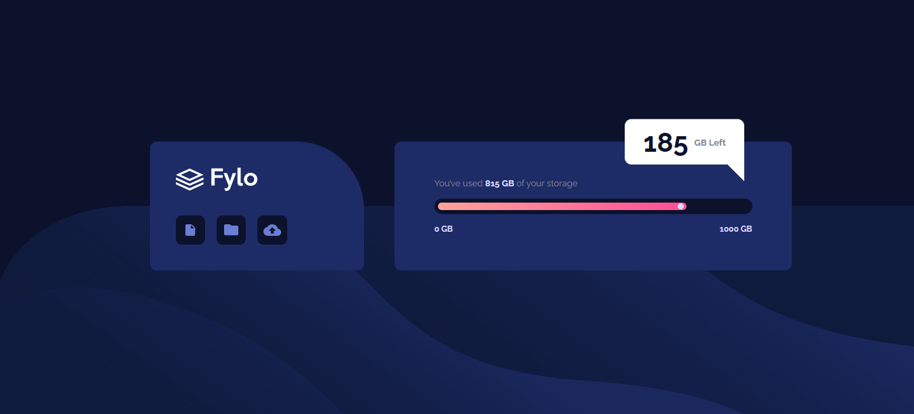
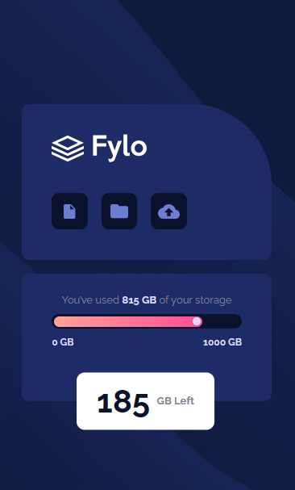

# Frontend Mentor - Fylo data storage component solution

This is a solution to the [Fylo data storage component challenge on Frontend Mentor](https://www.frontendmentor.io/challenges/fylo-data-storage-component-1dZPRbV5n). Frontend Mentor challenges help you improve your coding skills by building realistic projects. 

## Table of contents

- [Overview](#overview)
  - [The challenge](#the-challenge)
  - [Screenshot](#screenshot)
  - [Links](#links)
- [My process](#my-process)
  - [Built with](#built-with)
  - [What I learned](#what-i-learned)
  - [Continued development](#continued-development)
- [Author](#author)

**Note: Delete this note and update the table of contents based on what sections you keep.**

## Overview

### The challenge

Users should be able to:

- View the optimal layout for the site depending on their device's screen size

### Screenshot

### Links

[Frontend Mentor Solution URL](https://your-solution-url.com)
[Live Site URL](https://your-live-site-url.com)

## My process

### Built with

- Semantic HTML5 markup
- CSS custom properties
- Flexbox
- CSS Grid
- Mobile-first workflow

### What I learned

In this challenge I used mobile first concepts to develop the entire design and learned very efficient methods of adapting the design to different devices.

Furthermore, I built the entire layout with pure HTML and CSS only, strengthening the concepts in my head, making me create a more robust organization method.

### Continued development

For future projects I would like to continue with the mobile first method as I found it simpler to think about and develop than starting the approach on the desktop. I will also further reinforce the fundamental concepts of CSS to make development faster.

## Author

- Website - Coming soon...
- Frontend Mentor - [@LinkGr](https://www.frontendmentor.io/profile/LinkGr)